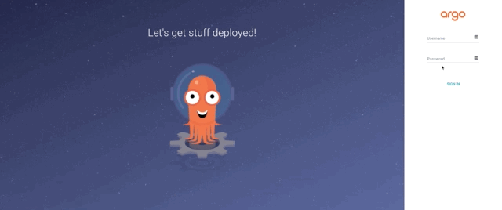
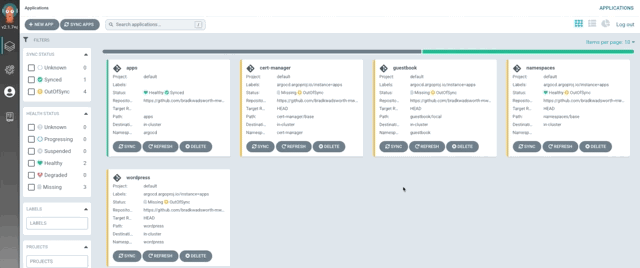
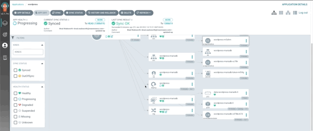
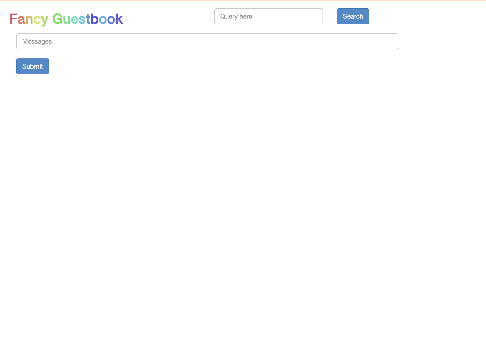
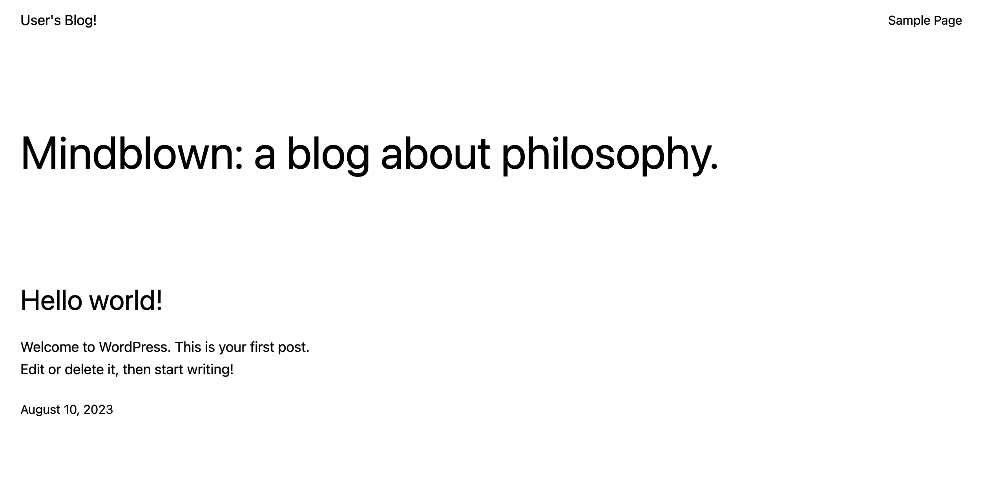
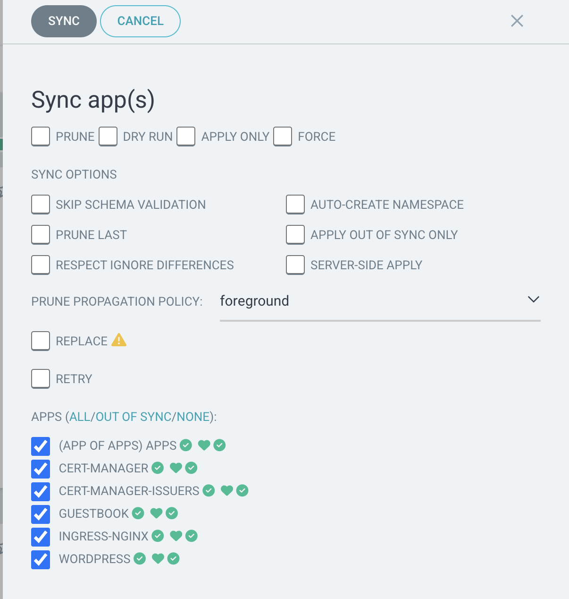

# ArgoCD Getting Started

## Requirements
* Docker
  * [Rancher Desktop](https://rancherdesktop.io/)
 
 Start up Rancher Desktop and keep it running. Rancher Desktop runs Kubernetes and container management on your desktop.

## Getting Started

This will create a local cluster, install ArgoCD, and set up the apps defined in this repo.

```sh
make create
```

(Optional) or if you want to use a different source Git repo and/or Git branch, use the following command.
```sh
make create GIT_URL=<git HTTP url> REVISION=<Git branch>
```

**BE SURE THAT YOUR `kubectl` CONTEXT IS POINTING TO YOUR LOCAL CLUSTER**

The following export command will change your kubeconfig file path. **Please note** this is permanent within the shell. To rerun this tutorial or work on a different kubernetes project, use a new shell (this will undo the change) or change the KUBECONFIG variable appropiately.

```sh
export KUBECONFIG=$PWD/kubeconfig
kubectl config current-context
```
Should return `kind-ignite-argocd`

## Local Development
Set port-forward
```sh
make port-forward
```
Should return `ArgoCD is listening on https://localhost:8080`

Retrieve the login credentials
```sh
make get-password
```
Should return something like `Login with admin/<password>`

### UI
Login to the ArgoCD URL at `https://localhost:8080/`. The default user name is admin and the '<password>' is obtained from the output above.

### (Optional) Changing your apps to source from a different repo.

If you completed the steps above using the given repo and you want to change the apps to be sourced from a different repo, use the command below.

```sh
make argocd-app GIT_URL=<Git HTTP url> REVISION=<Git branch>
```

## UI Tour
Once you are logged in the ArgoCD web UI you will see a page with several boxes. These boxes represent your Application



In this tutorial we are following the App of Apps pattern. With this pattern, an ArgoCD Application named `apps` is a manifest that points to a Helm chart that will generate more ArgoCD Application manifests.
**Note:** you do not have to use Helm to deploy your Kubernetes manifests; generic manifests and Kustomize are also supported.


The remaining Application blocks represent actual Helm charts or Kustomize manifests that deploy Kubernetes resources. Each Application will display the various Kubernetes resources that will be deployed into the cluster for that specific Application.



Some detail on Kubernetes can be viewed in these Applications, such as pod logs.



## Access Applications
Click these links to see your active application!

### Guestbook
http://guestbook-127.0.0.1.sslip.io:8000

Should look like



### Wordpress
https://wordpress-127.0.0.1.sslip.io:4430https://github.com/jaidenhausler-mw/ignite-argocd/blob/main/README.md

Should look like



## Sync Apps
Click on the 'SYNC APPS` button towards the top of the page to sync your cluster with the applications in the Git repo.



## Cleanup
This will delete the local cluster. Don't forget to close the shell to undo the change to the KUBECONFIG variable.

```sh
make clean
```

### CLI

The UI for argocd is what makes the application a great gitops tool. However, you can interact with it through the CLI.
```sh
argocd app sync -l argocd.argoproj.io/instance=apps
```

## CLI Logout
```sh
argocd logout localhost:8080
```
